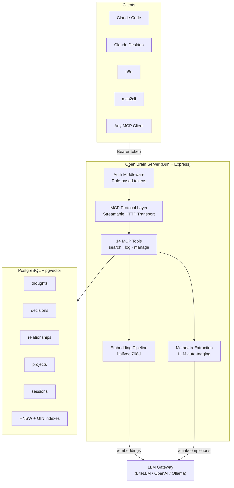

<p align="center">
  
  
  
  
  
  <a href="https://github.com/rodaddy/open-brain/actions/workflows/ci.yml"></a>
</p>

# Open Brain

**A local-first semantic knowledge base for AI agents.** Store thoughts, decisions, contacts, sessions, and projects — then retrieve them with hybrid vector + keyword search, cognitive tiering, and automatic metadata extraction.

Open Brain is an [MCP](https://modelcontextprotocol.io/) server that gives any AI agent persistent, searchable memory across conversations. Connect it to Claude Desktop, Claude Code, n8n, or any MCP-compatible client and your agent remembers everything.

---

## Why Open Brain?

AI agents are stateless. Every conversation starts from zero. Open Brain fixes that.

- **You own your data.** Everything lives in your PostgreSQL instance. No cloud dependency, no vendor lock-in, no data leaving your network.
- **Search that actually works.** Hybrid retrieval fuses HNSW vector similarity with PostgreSQL full-text search via Reciprocal Rank Fusion — better recall than either method alone.
- **Memory that self-curates.** Entries move through hot/warm/cold tiers based on access patterns. A curation pipeline deduplicates, scores quality, and archives stale content automatically.
- **Drop-in integration.** Any MCP client connects over HTTP with a Bearer token. No SDK, no wrapper library, no custom protocol.

---

## Architecture



---

## Quick Start

### Prerequisites

- [Bun](https://bun.sh/) v1.1+
- PostgreSQL 13+ with [pgvector](https://github.com/pgvector/pgvector)
- An OpenAI-compatible embedding endpoint ([LiteLLM](https://github.com/BerriAI/litellm), OpenAI, Ollama, etc.)

### 1. Clone and install

```bash
git clone https://github.com/rodaddy/open-brain.git
cd open-brain
bun install
```

### 2. Configure

```bash
cp .env.example .env
# Edit .env with your database and embedding endpoint details
```

At minimum, set these:

```env
DB_HOST=localhost
DB_PORT=5432
DB_NAME=open_brain
DB_USER=postgres
DB_PASSWORD=your-password

LITELLM_URL=http://localhost:4000   # Any OpenAI-compatible endpoint
LITELLM_API_KEY=your-key

# At least one auth token (generate with: openssl rand -hex 32)
AUTH_TOKEN_ADMIN=<your-token>
```

### 3. Database setup

```bash
# Enable pgvector (run once)
psql -d open_brain -c "CREATE EXTENSION IF NOT EXISTS vector;"

# Run migrations
bun run migrate
```

### 4. Start

```bash
bun run start
# ✓ Open Brain listening on http://localhost:3100
```

### 5. Connect an MCP client

Add to your Claude Desktop or Claude Code MCP config:

```json
{
  "mcpServers": {
    "open-brain": {
      "url": "http://localhost:3100/mcp",
      "headers": {
        "Authorization": "Bearer YOUR_TOKEN"
      }
    }
  }
}
```

That's it. Your agent now has persistent memory.

---

## Features

### 14 MCP Tools

| Tool | Op | Description |
|------|----|-------------|
| `search_brain` | R | Hybrid semantic + keyword search with tier boosting and recency weighting |
| `search_all` | R | Federated search across Open Brain and external knowledge bases |
| `log_thought` | W | Store a thought or observation with auto-embedding and metadata extraction |
| `log_decision` | W | Record a decision with rationale and considered alternatives |
| `find_person` | R | Search contacts by name (fuzzy) or semantic similarity |
| `upsert_person` | W | Create or update a contact with warmth scoring |
| `session_save` | W | Save a session summary with blockers, next steps, and key decisions |
| `session_load` | R | Load the most recent session, optionally filtered by project |
| `list_recent` | R | List recent entries across all tables with pagination and tier filtering |
| `get_entry` | R | Fetch a single entry by table and ID |
| `update_entry` | W | Update content, tags, or metadata on an existing entry |
| `archive_entry` | D | Soft-delete an entry with an optional reason |
| `rate_entry` | W | Score an entry's usefulness (0.0–1.0) |
| `set_tier` | W | Move an entry between cognitive tiers |

### Hybrid Search (RRF)

Every search runs two retrieval paths in parallel and fuses results via [Reciprocal Rank Fusion](https://plg.uwaterloo.ca/~gvcormac/cormacksigir09-rrf.pdf):

1. **Vector** — HNSW nearest-neighbor over `halfvec(768)` embeddings (cosine distance)
2. **Full-text** — PostgreSQL `tsvector` with English stemming and `ts_rank_cd`

The fused score is adjusted for:

| Factor | Effect |
|--------|--------|
| Cognitive tier | hot +0.3, warm neutral, cold −0.2 |
| Recency | Gentle decay: ~27% reduction at 1 year |
| Table weight | thoughts/decisions 1.2×, relationships 1.0×, projects 0.9×, sessions 0.8× |

Three search modes: `hybrid` (default), `vector`, `keyword`.

### Cognitive Tiering

Entries flow through three memory tiers based on access patterns:

```
                 3+ accesses / 7 days          0 accesses / 7 days
  ┌───────┐  ──────────────────────►  ┌───────┐  ◄─────────────────  ┌───────┐
  │  HOT  │                           │ WARM  │                      │ COLD  │
  │ +0.3  │  ◄──────────────────────  │  0.0  │  ──────────────────► │ -0.2  │
  └───────┘     accessed again        └───────┘   0 accesses / 30d   └───────┘
                                         ▲                               │
                                         │        new entry              │
                                         └───────────────────────────────┘
                                              accessed → rescue
```

Cold entries with zero access for 60+ days are candidates for archival by the curation pipeline.

### Auto-Embedding and Metadata Extraction

Every write operation automatically:
1. **Embeds** content into a 768-dimensional half-precision vector via your configured LLM gateway
2. **Deduplicates** using SHA-256 content hashing — duplicate writes merge tags instead of creating duplicates
3. **Extracts metadata** (topics, entities, action items) via a background LLM call (when `EXTRACTION_MODEL` is set)

### Role-Based Access Control

Each consumer gets a scoped Bearer token. Permissions are enforced per table:

| Role | Read | Write | Delete |
|------|------|-------|--------|
| `admin` | all tables | all tables | all tables |
| `agent` | all tables | thoughts, decisions, sessions | — |
| `discord` | thoughts, decisions, relationships | sessions | — |
| `n8n` | all tables | sessions | all tables |
| `readonly` | all tables | — | — |

Tokens are set via environment variables (`AUTH_TOKEN_ADMIN`, `AUTH_TOKEN_AGENT`, etc.). Custom per-user tokens are supported with the `AUTH_TOKEN_USER_*` pattern.

Token verification uses constant-time comparison across all tokens to prevent timing attacks.

### Curation Pipeline

Automated knowledge maintenance via `bun run curate`:

- **Duplicate detection** — HNSW nearest-neighbor scan, archives entries with cosine distance < 0.08
- **Staleness decay** — entries with zero access after 90 days get an LLM verdict: KEEP, ARCHIVE, or DOWNGRADE
- **Quality scoring** — low-usefulness, untagged entries are re-scored by LLM (0–1)
- **Dry run** — `bun run curate -- --dry-run` shows what would change without writing

Safe for cron. Idempotent via `archived_at IS NULL` guards.

---

## Database Schema

Five core tables, all with `halfvec(768)` embeddings, HNSW vector indexes, and GIN full-text indexes:

| Table | Purpose | Key Fields |
|-------|---------|------------|
| `thoughts` | Ideas, observations, notes | `content`, `tags[]`, `source`, `extracted_metadata` |
| `decisions` | Titled choices with rationale | `title`, `rationale`, `alternatives[]`, `context` |
| `relationships` | Contacts / people | `person_name` (unique), `warmth` (1–5), `email`, `phone` |
| `projects` | Named project entities | `name` (unique), `status`, `description`, `metadata` |
| `sessions` | AI session summaries | `session_id`, `project`, `summary`, `blockers[]`, `next_steps[]` |

Every row also includes: `id` (UUID), `tier` (hot/warm/cold), `namespace`, `content_hash`, `embedding`, `usefulness_score`, `access_count`, `archived_at`, `created_at`, `updated_at`.

Supporting tables: `entry_access_log` (usage tracking), `discarded_entries` (archive staging), `_migrations`.

---

## Scripts

| Command | Description |
|---------|-------------|
| `bun run start` | Start the MCP server |
| `bun run migrate` | Run pending database migrations |
| `bun run test` | Run test suite (80% coverage threshold) |
| `bun run typecheck` | Type-check without emit |
| `bun run backfill` | Backfill NULL embeddings across all tables |
| `bun run curate` | Automated curation: dedup, staleness, quality scoring |

Additional scripts in `scripts/`:

| Script | Description |
|--------|-------------|
| `generate-tokens.sh` | Token generation, verification, and rotation |
| `bulk-import.ts` | Batch import from JSON/CSV with deduplication |
| `obsidian-sync.ts` | Export entries to an Obsidian vault as Markdown + YAML frontmatter |
| `ob-backfill.ts` | Extract session data from Claude Code transcripts |

---

## API Reference

### HTTP Endpoints

| Method | Path | Auth | Description |
|--------|------|------|-------------|
| `GET` | `/health` | — | Database + LLM connectivity check |
| `POST` | `/mcp` | Bearer | MCP initialize or route to existing session |
| `GET` | `/mcp` | Bearer | MCP SSE stream for existing session |
| `DELETE` | `/mcp` | Bearer | Close an MCP session |

### Health Check Response

```json
{
  "status": "ok",
  "database": "connected",
  "litellm": "connected",
  "timestamp": "2025-01-15T10:30:00.000Z"
}
```

### Session Management

- Max 100 concurrent MCP sessions
- 30-minute TTL with inactivity reset on every request
- Background sweeper cleans expired sessions every 5 minutes
- Session identity (role + client) verified on every request

---

## Project Structure

```
open-brain/
├── src/
│   ├── index.ts              # Express server bootstrap & routes
│   ├── server.ts             # MCP server factory
│   ├── transport.ts          # Streamable HTTP transport & session lifecycle
│   ├── auth.ts               # Token parsing & role resolution
│   ├── permissions.ts        # RBAC permission matrix
│   ├── embedding.ts          # Embedding generation & content hashing
│   ├── extraction.ts         # LLM metadata extraction pipeline
│   ├── types.ts              # Shared TypeScript types
│   ├── logger.ts             # Structured JSON logger
│   ├── tools/                # 14 MCP tool implementations
│   │   ├── index.ts          # Tool registration orchestrator
│   │   ├── search-brain.ts   # Hybrid RRF search engine
│   │   ├── search-all.ts     # Federated cross-source search
│   │   ├── log-thought.ts    # Thought logging with dedup
│   │   ├── log-decision.ts   # Decision logging with alternatives
│   │   ├── find-person.ts    # Contact search (name + semantic)
│   │   └── ...               # session-save, list-recent, update-entry, etc.
│   ├── db/
│   │   ├── pool.ts           # Connection pool with pgvector types
│   │   ├── migrate.ts        # SQL migration runner
│   │   └── migrations/       # 001–008 SQL migration files
│   └── middleware/
│       └── request-logger.ts # Request logging middleware
├── scripts/                  # Utility scripts (sync, import, curate)
├── deploy/                   # Systemd service file
├── hooks/                    # Claude Code session capture hooks
├── .github/workflows/        # CI + AI code review
├── .env.example              # Environment template
└── .env.schema               # Varlock schema for secret management
```

---

## Comparison with Alternatives

| Feature | Open Brain | Mem0 | Zep | LangMem |
|---------|-----------|------|-----|---------|
| **Protocol** | MCP (standard) | REST API | REST API | Python SDK |
| **Hosting** | Self-hosted only | Cloud + self-hosted | Cloud + self-hosted | In-process |
| **Search** | Hybrid RRF (vector + FTS) | Vector only | Vector + temporal | Vector only |
| **Memory tiers** | Hot / warm / cold | Flat | Flat | Flat |
| **Auto-curation** | LLM-as-judge pipeline | Manual | Session-based | Manual |
| **Auth model** | Role-based, per-consumer | API key | API key | N/A |
| **Database** | PostgreSQL + pgvector | Qdrant / Postgres | Postgres / Neo4j | In-memory / Postgres |
| **AI client support** | Any MCP client | REST clients | REST clients | LangChain only |
| **Data ownership** | Full (your Postgres) | Depends on plan | Depends on plan | Full |

---

## Use Cases

- **AI agent memory** — Give Claude, GPT, or any MCP-compatible agent persistent recall across sessions
- **Personal knowledge base** — Log thoughts, decisions, and contacts with semantic search
- **Session continuity** — Save and restore AI session context including blockers, decisions, and next steps
- **Team knowledge graph** — Namespace-isolated knowledge with role-based access for multiple agents or users
- **Obsidian integration** — Auto-sync entries to an Obsidian vault with wikilinks and Dataview-compatible frontmatter

---

## CI/CD

Pull requests trigger automated checks via GitHub Actions:

- **CI** — typecheck, migrations against `pgvector/pgvector:pg17`, unit tests with 80% coverage threshold
- **Claude Code Review** — AI-powered review focused on bugs, security, performance, and embedding quality

---

## Documentation

- [CONTRIBUTING.md](CONTRIBUTING.md) — development workflow, coding standards, and infrastructure rules
- [GLOSSARY.md](GLOSSARY.md) — domain terminology (tiers, warmth, dream cycles, etc.)

---

## License

[MIT](LICENSE)
